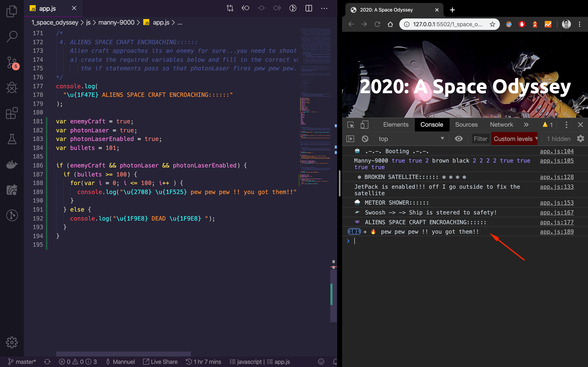

# FEU1 Programming Foundations

Learning how to program.

## 1. Space Odyssey command line game

photo credit: https://www.warnerbros.com/movies/2001-space-odyssey/

### How to

1. fork repo
2. clone repo
3. make a new branch for todays adventure
4. open project in VS CODE
5. open `index.html` inside the `1_space_odyssey` folder and use [VS CODE Live Server](https://marketplace.visualstudio.com/items?itemName=ritwickdey.LiveServer) to run the site
6. in the `js` folder create folder for you eg. `manny-9000` and in it create an `app.js` file
7. open `_adventures-9000/app.js` copy the contents into your `app.js` 
1. conquer each adventure in sequence that they appear
2. definition of done is a pull request

Best way to play split your screen in two, have the browser console open on the right so that you can see the console output as you code (Don't code blind). 

Also in the `index.html` page only include `your` javascript file

