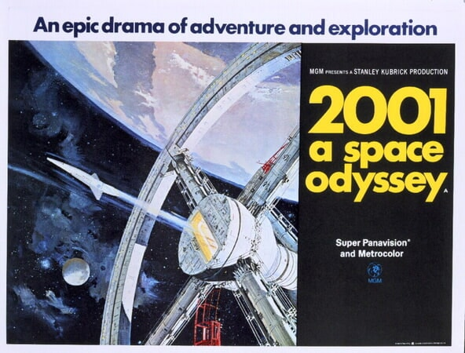

# FEU1 Programming Foundations

Learning how to program.

# 1. Space Odyssey command line game

1. Fork repo
2. clone repo
3.  open project in VS CODE
4.  open `index.html` inside the `1_space_odyssey` folder
5.  use VS CODE Live Server to run the site.
6.  definition of done is a pull request

photo credit: https://www.warnerbros.com/movies/2001-space-odyssey/